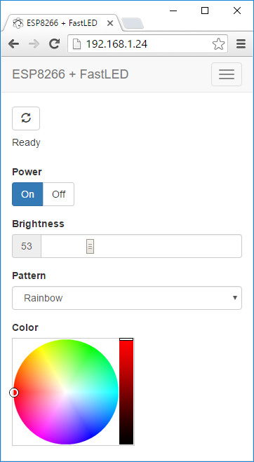

Ultim8x8 RGB LED Panel + FastLED + ESP8266 Web Server
=========

Control an [ULTiM8x8 RGB LED Panel] with an ESP8266 via a web browser.

Hardware
--------

[Adafruit Feather HUZZAH with ESP8266 WiFi]

[ULTiM8x8 RGB LED Panel]

Features
--------
* Turn the LEDs on and off
* Adjust the brightness
* Change the display pattern
* Adjust the color

Web App
--------

Patterns are requested by the app from the ESP8266, so as new patterns are added, they're automatically listed in the app.

The web app is stored in SPIFFS (on-board flash memory).

The web app is a single page app with separate files for js and css, using [jQuery](https://jquery.com) and [Bootstrap](http://getbootstrap.com).  It has buttons for On/Off, a slider for brightness, a pattern selector, and a color picker (using [jQuery MiniColors](http://labs.abeautifulsite.net/jquery-minicolors)).  Event handlers for the controls are wired up, so you don't have to click a 'Send' button after making changes.  The brightness slider and the color picker use a delayed event handler, to prevent from flooding the ESP8266 web server with too many requests too quickly.

Installing
-----------

The web app needs to be uploaded to the ESP8266's SPIFFS.  You can do this within the Arduino IDE after installing the [Arduino ESP8266FS tool](https://github.com/esp8266/Arduino/blob/master/doc/filesystem.md#uploading-files-to-file-system).

With ESP8266FS installed run the sketch and then upload the web app using `ESP8266 Sketch Data Upload` command in the Arduino Tools menu.

Compression
-----------

The web app files can be gzip compressed before uploading to SPIFFS by running the following command:

`gzip -r data/`

The ESP8266WebServer will automatically serve any .gz file.  The file index.htm.gz will get served as index.htm, with the content-encoding header set to gzip, so the browser knows to decompress it.  The ESP8266WebServer doesn't seem to like the Glyphicon fonts gzipped, though, so I decompress them with this command:

`gunzip -r data/fonts/`

REST Web services
-----------------

The firmware implements basic [RESTful web services](https://en.wikipedia.org/wiki/Representational_state_transfer) using the ESP8266WebServer library.  Current values are requested with HTTP GETs, and values are set with POSTs using query string parameters.  It can run in connected or standalone access point modes.

[ULTiM8x8 RGB LED Panel]:https://www.crowdsupply.com/maniacal-labs-wyolum/ultim8x8
[Adafruit Feather HUZZAH with ESP8266 WiFi]:https://www.adafruit.com/products/2471
